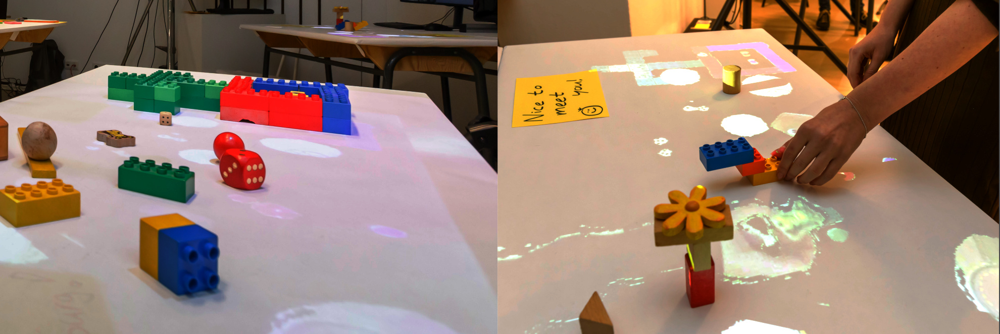
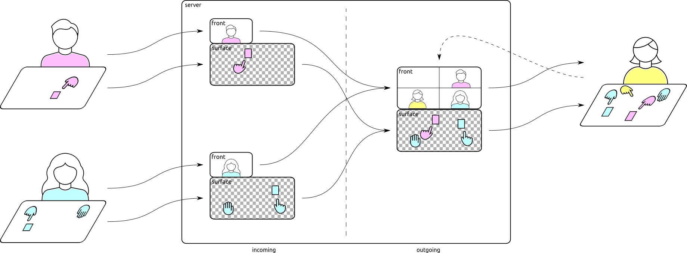

# SurfaceStreams

A framework to mix and distribute live video feeds from interactive surfaces via WebRTC.


Image credit: (c) Stadt Regensburg, (c) Stefan Effenhauser (see also the [VIGITIA](https://vigitia.de/) project)

SurfaceStreams consists of a mixing server, and one or more clients. Each clients sends one audiostream and two video streams: a plain old webcam feed of the user called the _front stream_, and a second feed of a rectified interactive surface called the _surface stream_. The surface stream is expected to have any background removed and chroma-keyed with 100% bright green.

The mixing server then composes a new surface stream for each client, consisting of the layered surface streams of the _other_ clients, and streams that back to each client (along with a single combined front stream of all individual front streams arranged side-by-side).



## HowTo

Here's an example walkthrough of how to connect an interactive surface with a browser client:

 * on a server host with sufficient CPU resources, run the mixing backend: `./webrtc_server.py`
 * start the browser client:
   * with Chrome or Firefox, go to `https://${SERVER_HOST}:8080/stream.html`
   * allow access to camera/microphone
   * you should then see your own webcam stream and a black canvas after a few seconds
   * try doodling on the black canvas (left mouse button draws, right button erases)
 * start the interactive surface:
   * setup and calibrate [SurfaceCast](https://github.com/floe/surfacecast) to stream the surface on virtual camera `/dev/video20` (see Usage - Example 2)
   * run the Python client: `./webrtc_client.py -t ${SERVER_HOST} -s /dev/video20 -f /dev/video0` (or whatever device your plain webcam is)
   * put the `surface` window as fullscreen on the surface display, and the `front` window on the front display
 * connect additional browser and/or surface clients (up to 4 in total)

## Clients

Python client commandline parameters:

```
  --fake                use fake sources (desc. from -f/-s)
```
Mostly useful for testing, will create default outgoing streams with fake test data (TV test image, moving ball, tick sounds).
If any of `-f/-s/-a` are also given, the string will be interpreted as a GStreamer bin description.

```
  -m, --main            flag this client as main (lowest z)
```
If a client does not have background filtering (i.e. a plain webcam), then you can use this flag to make sure that the surface stream from this client is always placed below all others. Note you can only have one "main" client per session, otherwise the surface mixing will get messed up.

```
  -a AUDIO, --audio AUDIO
  -f FRONT, --front FRONT
  -s SURFACE, --surface SURFACE
                        audio/front/surface source (device name or pipeline)
```
If any of these are given without ``--fake``, they will be interpreted as a device name (e.g. `/dev/video0`). Otherwise, they will be interpreted as a GStreamer bin description (e.g. `"videotestsrc ! timeoverlay"`). Note that in the second case the whole string needs to be quoted.

```
  -p PORT, --port PORT  server HTTPS listening port (8080)
  -t TARGET, --target TARGET
                        server to connect to (127.0.0.1)
```
Used to give the hostname or IP address of the server, and optionally a non-default port to connect to.

```
  -u STUN, --stun STUN  STUN server
```
If you want to use a different STUN server than the default (stun://stun.l.google.com:19302), specify here.

```
  -n NICK, --nick NICK  client nickname
```
Can be used to give a label (e.g. "Alice" or "Bob") to the frontstream.

## Server

...

## Requirements

* Mixing server & standalone client
  * Ubuntu 20.04 LTS (Python 3.8, GStreamer 1.16)
  * Debian 11 "Bullseye" (Python 3.9, GStreamer 1.18)
  * Install dependencies: `sudo apt install gstreamer1.0-libav gir1.2-soup-2.4 gir1.2-gstreamer-1.0 gir1.2-gst-plugins-bad-1.0 gir1.2-gst-plugins-base-1.0 gir1.2-nice-0.1 libnice10 gstreamer1.0-nice gstreamer1.0-plugins-bad gstreamer1.0-plugins-good gstreamer1.0-plugins-ugly`

* HTML5 client
  * Firefox 78 ESR (Note: remember to enable OpenH264 plugin in `about:plugins`)
  * Firefox 94 - 96
  * Chrome 92 - 97

## Known issues

  * Server
    * The server will repeatedly issue the warning `[...]: loop detected in the graph of bin 'pipeline0'!!`, which can be safely ignored.
    * Some race conditions when setting up the mixers still seem to be present, but hard to pin down. This happens particularly when a client connects within a few seconds of the previous client, before negotiation has completed. Usually shows up as a black surface stream, restart the client in this case.
  * Python Client
    * Using webcams as live sources (e.g. for the front stream) is somewhat hit-and-miss and depends on the pixel formats the webcam can deliver. Reliable results so far only with 24-bit RGB or 16-bit YUYV/YUV2 (see also [issue #4](https://github.com/floe/surfacestreams/issues/4)). The front/face cam needs to support 640x360 natively, the surface cam needs to support 1280x720 natively. Good results with Logitech C270 (front/face) and C920 (surface). Note: environment variable `GST_V4L2_USE_LIBV4L2=1` can sometimes be used to fix format mismatch issues.
    * The Python client has a noticeable delay (sometimes on the order of 30 seconds) before the surface stream finally starts running, unlike e.g. the browser client (see also [issue #2](https://github.com/floe/surfacestreams/issues/2)). Once it runs, the delay is negligible, but the waiting time until things synchronize is iffy.
    * A Raspberry Pi 4 is just barely fast enough to handle the incoming and outgoing streams _plus_ the SurfaceCast perspective transform. Overclocking to 1800 core/600 GPU is recommended.
  * HTML5 client
    * not working on Chromium (non-free codec problem, see [issue #8](https://github.com/floe/surfacestreams/issues/8))
    * not working on Safari (reason unknown, see [issue #6](https://github.com/floe/surfacestreams/issues/6))
